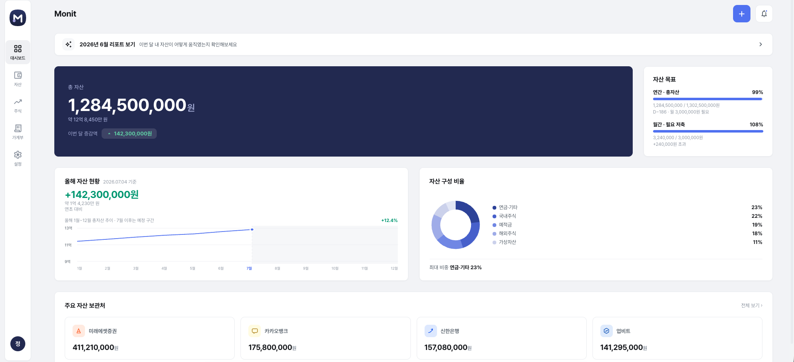

# Monit (모닛)

개인 자산관리 웹앱 **Monit**의 프론트엔드입니다. 대시보드에서 총자산·자산목표·자산구성을 한눈에 보고, 자산/주식/가계부를 각각 관리하는 개인용 자산관리 도구입니다.



## 주요 화면

- **대시보드**: 총자산, 연간/월간 자산 목표 달성률, 올해 자산 추이 그래프, 자산 구성 비율(도넛차트), 주요 자산 보관처 요약
- **자산**: 카테고리별(현금/예적금/국내주식/해외주식/가상자산/연금·기타) 자산 현황과 트리맵 뷰, 계좌별 상세
- **주식**: 보유 종목, 시장 지수, 섹터/국가별 수익률
- **가계부**: 수입/지출/저축/이체 내역, 카테고리별 지출 분석, 구독·정기결제 관리, 캘린더 뷰
- **설정**: 테마(라이트/다크), 가계부 카테고리 커스터마이즈 등

## 기술 스택

- [React 19](https://react.dev/) + TypeScript
- [Vite](https://vite.dev/) (빌드 도구)
- [pnpm](https://pnpm.io/) (패키지 매니저)
- [oxlint](https://oxc.rs/) (린터)
- 순수 CSS (CSS 커스텀 프로퍼티 기반 디자인 토큰) — Tailwind나 CSS-in-JS 라이브러리는 사용하지 않음

상태관리는 별도 라이브러리 없이 단일 `AppState` 객체 + reducer 패턴으로 구현되어 있습니다.

## 시작하기

```bash
pnpm install       # 의존성 설치
pnpm dev           # 개발 서버 실행 (HMR)
pnpm build         # 타입체크(tsc -b) + 프로덕션 빌드
pnpm lint          # oxlint 실행
pnpm preview       # 프로덕션 빌드 미리보기
```

## 프로젝트 구조 / 개발 가이드

폴더 구조, 코딩 컨벤션, 도메인 용어 등 상세한 개발 가이드는 [`CLAUDE.md`](./CLAUDE.md)를 참고하세요.
