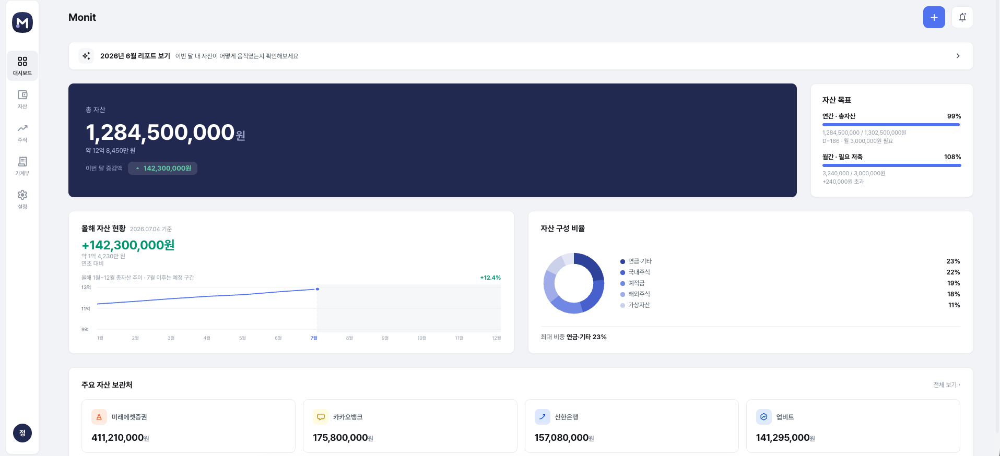
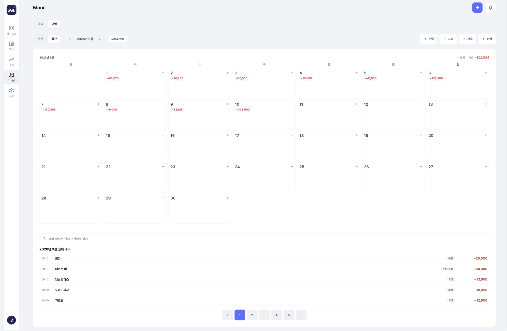

# Monit

> 예·적금, 국내외 주식, 가상자산, 가계부를 한 곳에서 관리하는 **개인 자산관리 서비스**입니다.

| 항목 | 내용 |
|---|---|
| 기간 | 2026.08 – 진행 중 |
| 인원 | 1명 (설계·개발·운영) |
| 담당 | 자산·거래 도메인 설계, 시계열 자산 재계산, JWT·Refresh Token 인증, 환율·시세 수집 배치, SSE 알림, React SPA, EC2 배포·운영 |
| 기술 | Java 21 · Spring Boot 4.1 · Spring Security · JWT · JPA · QueryDSL · PostgreSQL · Redis · React 19 · TypeScript · Vite · React Query · Zustand |
| 사이트 | https://monit.io.kr |
| 백엔드 | https://github.com/Ssspil/asset-management-backend |

 

## 목차

1. [서비스 개요](#1-서비스-개요)
2. [화면](#2-화면)
3. [핵심 설계 · 트러블슈팅](#3-핵심-설계--트러블슈팅)

 

## 1. 서비스 개요

- **대시보드**에서 총자산, 이번 달 증감, 연간·월간 목표 진행률, 1~12월 총자산 추이, 자산 구성, 기관별 보관처를 한눈에 봅니다.
- **자산**은 예적금·주식·가상자산·현금·연금 등 계좌 단위로 등록하고, 카테고리·기관별 트리맵과 유동성 뷰로 분포를 봅니다.
- **주식**은 매수·매도 기록을 남기면 수량·평단가·평가손익·그룹 수익률이 계산되고, 외화 예수금과 환전·환차익까지 다룹니다.
- **가계부**는 급여일 기준 정산월로 수입·지출·저축·이체를 기록하고, 고정지출·구독을 자동 차감합니다.
- 잔액·평단가·수익률·과거 총자산을 **저장하지 않고 거래 원장에서 매번 계산**해, 어떤 화면에서든 숫자가 하나의 공식으로 맞아떨어집니다.
- 증권사·거래소 API 키 연동, SSE 실시간 알림, XLSX 가져오기·내보내기를 제공하며 실제로 매일 쓰는 앱으로 운영 중입니다.

 

## 2. 화면

<table>
  <tr>
    <th width="50%">대시보드</th>
    <th width="50%">가계부</th>
  </tr>
  <tr>
    <td></td>
    <td></td>
  </tr>
  <tr>
    <td>총자산과 이번 달 증감, 연간·월간 목표 진행률, 1~12월 총자산 추이(스냅샷 없이 시점별 재계산), 자산 구성 도넛, 기관별 보관처. 차트는 라이브러리 없이 SVG로 직접 구현.</td>
    <td>정산월(월 시작일 1~28일) 기준 월간·주간 캘린더에 일별 합계를 표시하고 수입·지출·저축·이체 4가지 거래를 입력합니다. 날짜 칸 클릭 필터, 내용·메모 전체 기간 검색, 고정지출·구독 자동 차감.</td>
  </tr>
</table>

 

## 3. 핵심 설계 · 트러블슈팅

### 배포, 운영 모니터링 Slack 알림

**문제** 외부 환율 API가 인증서 체인 오류로 실패해 환율이 수집되지 않았는데, **장애를 알아챌 방법이 서버 로그뿐**이었습니다. 서버를 실시간으로 지켜볼 수 없어 늦은 밤에 잠깐 접속해 500 에러나 배포 실패를 확인하는 게 전부였고, 그 사이 자산 현황은 틀린 채 방치됐습니다.

**해결** 처리되지 않은 예외가 500으로 떨어지는 순간 전역 예외 핸들러가 **예외 종류·요청 경로·스택 상위 5줄을 Slack Webhook으로 전송**합니다. 전송은 별도 스레드에서 비동기로 처리해 응답을 지연시키지 않고, 같은 예외·같은 경로는 **5분에 한 번만** 보내 알림 폭주를 막습니다. 배포는 재시작 뒤 **최대 60초 헬스체크**에 실패하면 직전 jar로 자동 롤백하고, 결과를 GitHub Actions가 Slack으로 보냅니다.

**결과** 500 에러가 나면 **요청 경로, 예외 종류와 메시지, 발생 시각, 스택 상위 5줄**이 Slack으로 와서 서버에 들어가지 않고도 어떤 오류인지 바로 압니다. 배포가 끝나면 **커밋·작성자·빌드와 배포 결과·실행 로그 링크**가 와서 어느 커밋에서 왜 실패했는지 폰으로 확인합니다.
